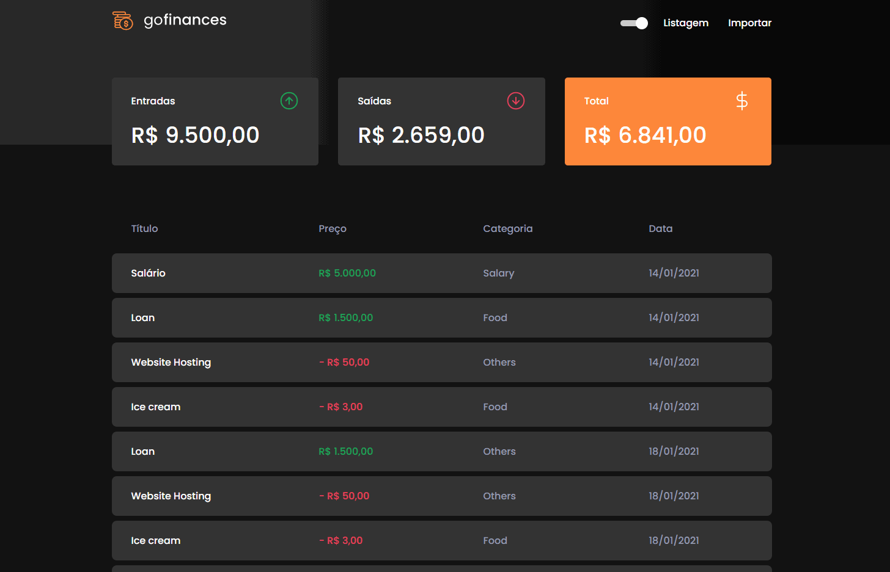
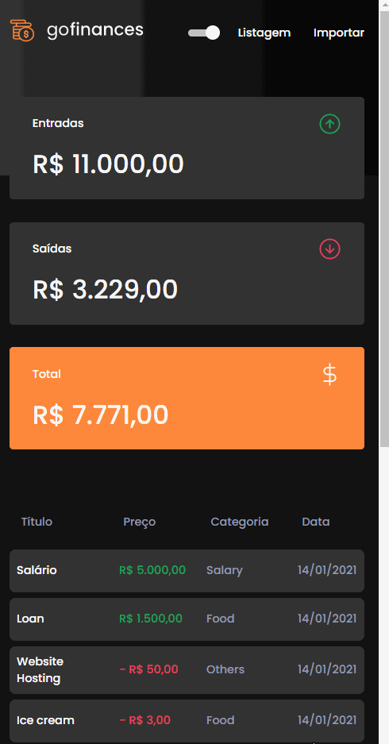

<h1 align="center">
  
</h1>

</h4>

### Go Finances is an application designed to store incoming and outgoing financial transactions and allow the registration and listing of these transactions, in addition to allowing the creation of new records in the database by sending a csv file.

# <b> ⚡ Demonstration </b>

<h4 align="center">


</h4>

# 🛠 <b> Technologies </b>

The following tools were used in the construction of the project:

- [ReactJS](https://reactjs.org/)
- [Styled Components](https://styled-components.com/) - Framework to style React Components.
- [TypeScript](https://www.typescriptlang.org/)
- [React Hooks](https://reactjs.org/docs/hooks-intro.html) - Hooks are functions that let you “hook into” React state and lifecycle features from function components.
- [Axios](https://github.com/axios/axios)

  <br>

# <b> 🔥 Installation </b>

Before you begin, you will need to have the following tools installed on your machine:
[Git](https://git-scm.com), [Node.js](https://nodejs.org/en/).

After that, let's move on to the next steps.

<br>

```bash
git clone https://github.com/RodzAlves/gofinances-web.git
```

Access the project folder

```bash
cd gofinances-web
```

Install dependencies

```bash
npm install or yarn
```

And the run the server:

```bash
yarn start or npm run start

# The server will start in: http://localhost:3000
```

And ready! The front-end a GoFinances project is already running.

<br>

# <b> 🚀 Testing the Front-end </b>

To install the front-end of this application it is recommended that you follow the steps on the link below and run the GoFinances API.

- [<b>GoFinances API</b>](https://github.com/RodzAlves/gofinances-backend)

<br>

[<b>Rodrigo Alves</b>](https://github.com/RodzAlves)
<br>
Made with 💜 by Rodrigo Alves 👋 <br>
<a href="https://www.linkedin.com/in/rodrigo-alves-dev/" alt="LinkedIn" target="blank">

   <p align="left" >
  <a href="mailto:rodrigoalvesbrasileiro@gmail.com" alt="Gmail">
  </a>

  <a href="https://www.linkedin.com/in/rodrigo-alves-dev/" alt="Linkedin">
  </a>

</p>
  </a>
